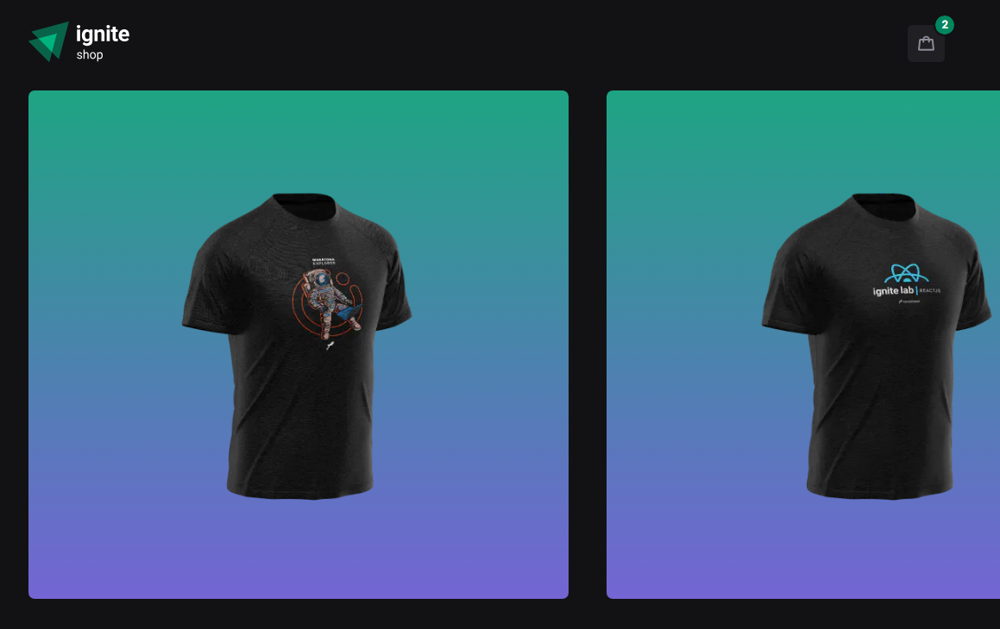
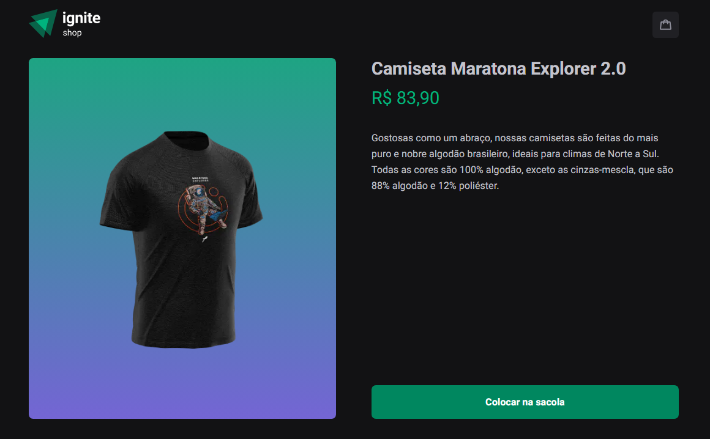
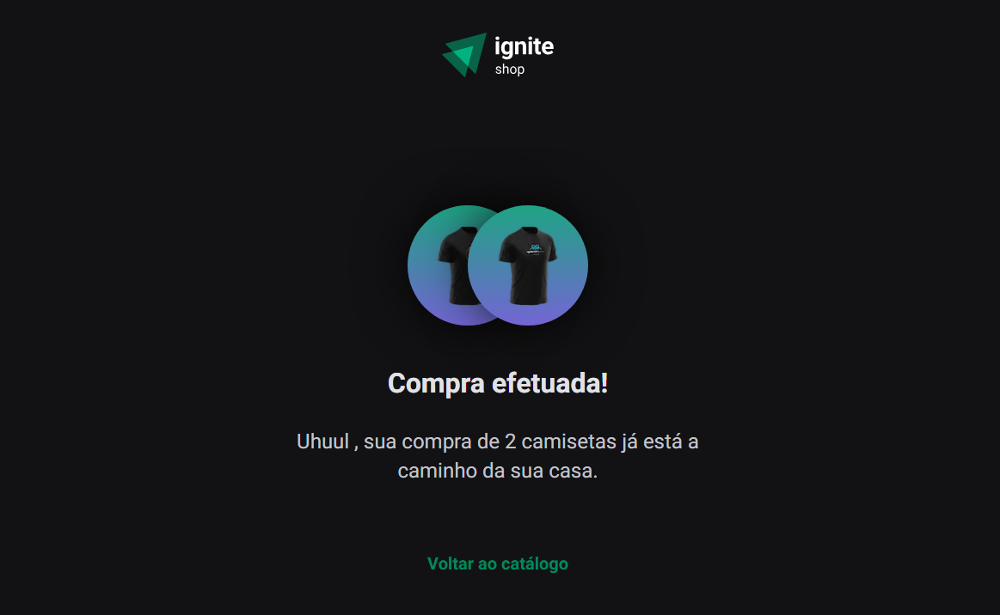

# Ignite Shop NextJS SSG | SSR 

<p align="center">
  

  

   <a href="https://github.com/GianDutra/coffee-delivery/commits/master">
    
  </a>
  
 <a href="https://shop-nextjs-2.vercel.app/">
    
  </a>
  
</p>



> Desafio da RocketSeat no qual desenvolvi um projeto durante o Curso Ignite da trilha de ReactJS e aprimorei o website adicionando novas funcionalidades.

## Linguagens e Tecnologias usadas

Para criar o site foi utilizado:

#### **Website**  ([NextJS](https://nextjs.org/)  +  [React](https://reactjs.org/)  +  [TypeScript](https://www.typescriptlang.org/))
- **[PhosphorIcons](https://phosphoricons.com/)**
- **[Stitches](https://stitches.dev/)**
- **[RadixUI](https://www.radix-ui.com/)**
- **[Axios](https://www.axios.com/)**
- **[EmblaCarousel](https://www.embla-carousel.com/)**
  
#### **API**
- **[Stripe](https://stripe.com/)**

## Ajustes e melhorias

- [x] Adicionar produtos no carrinho
- [x] Remover item do carrinho
- [x] Implementar Stripe API para realizar pagamentos 
- [x] Substituir Keen Slider por Embla Carousel

## Testando a aplicação 

Caso você queira testar a compra das camisas, use este cartão de crédito falso:
```env
4242 4242 4242 4242
# Pode usar qualquer data valida como vencimento do cartão
# Pode usar qualquer CVC
```

## 💻 Pré-requisitos

Antes de começar, verifique se você possui instalado:

* [Node.js](https://nodejs.org/en/)
* [Git](https://git-scm.com)

## 🚀 Instalando <Shop-Nextjs-Challenge>

 
```bash

# Clone este repositório
$ git clone https://github.com/GianDutra/Shop-Nextjs-Challenge.git

# Acesse a pasta do projeto no seu terminal
$ cd Shop-Nextjs-Challenge

# Instale as dependências
$ npm install

# Rode o aplicativo no modo de desenvolvedor
$ npm run dev

# O aplicativo vai abrir por padrão na porta: 3000 - vá para http://localhost:3000/

```

---


## 👨‍💼 Autor

<table>
  <tr>
    <td align="center">
      <a href="#">
        <br>
        <sub>
          <b>Gian Dutra</b>
        </sub>
      </a>
    </td>
  </tr>
</table>
